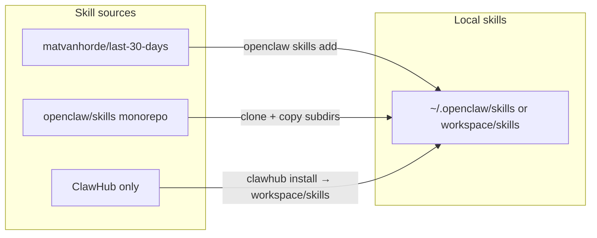

# 将 awesome-openclaw-usecases 相关技能克隆到本地并补充 Twitter AI 监控技能

## 背景与约束

- [awesome-openclaw-usecases](https://github.com/hesamsheikh/awesome-openclaw-usecases) 是**用例文档**集合（markdown），不是可安装的 skill 仓库；每个用例里会引用具体 skill 及其安装方式。
- OpenClaw 从 `~/.openclaw/skills/<name>/SKILL.md`（managed）或 `<workspace>/skills/<name>/SKILL.md`（workspace）加载技能；每个 skill 必须是**直接子目录**且内含 `SKILL.md`（见 [src/agents/skills/workspace.ts](src/agents/skills/workspace.ts) 的 `loadWorkspaceSkillEntries` 与 `loadSkills`）。
- 你已实现 `openclaw skills add <url>`：克隆 https 仓库到 `~/.openclaw/skills/<repo-name>` 并在有 `package.json` 时执行依赖安装。

## 用例与技能来源一览

| 用例                                | 技能来源                                                    | 安装方式                                                                      |
| ----------------------------------- | ----------------------------------------------------------- | ----------------------------------------------------------------------------- |
| Personal Knowledge Base (RAG)       | ClawdHub `knowledge-base`                                   | ClawHub：`npx clawhub@latest install knowledge-base`，无公开 Git 仓库         |
| Market Research & Product Factory   | [Last 30 Days](https://github.com/matvanhorde/last-30-days) | **可克隆**：`openclaw skills add https://github.com/matvanhorde/last-30-days` |
| Daily Reddit Digest                 | ClawdHub `reddit-readonly` (buksan1950/reddit-readonly)     | ClawHub 安装，无公开 Git 仓库                                                 |
| Daily YouTube Digest                | ClawdHub `youtube-full` (therohitdas/youtube-full)          | ClawHub 安装，无公开 Git 仓库                                                 |
| **Twitter/X AI 监控**（你额外要求） | **xai-search** / **search-x**（openclaw/skills 归档）       | 见下文「从 openclaw/skills 取出单 skill」                                     |

- **Last 30 Days**：独立仓库，支持 Reddit/X/Web 近 30 天调研，与「Market Research & Product Factory」用例一致，可直接用 `skills add <url>`。
- **Twitter AI 监控**：社区与 Playbooks 提到 [xai-search](https://playbooks.com/skills/openclaw/skills/xai-search)（Grok API，X + 网页实时搜索）、[search-x](https://playbooks.com/skills/openclaw/skills/search-x)（Grok 或 X API，推文/趋势/讨论）。二者均在 [openclaw/skills](https://github.com/openclaw/skills) 的 **monorepo** 中，路径为 `skills/xai-search`、`skills/search-x` 等（该仓库为 clawdhub.com 的归档，`skills/` 下为大量子目录，每个子目录一个 skill）。

## 实现思路

- **可 Git 克隆的**：用现有 `openclaw skills add <url>` 或等价的 `git clone` + 依赖安装。
- **仅 ClawHub 的**：不克隆；在文档中写明用 ClawHub 安装到 workspace `./skills`，开发时通过配置 workspace 或 `OPENCLAW_CONFIG_DIR` 使这些目录被加载。
- **仅存在于 openclaw/skills 的**：整库克隆后只取需要的子目录到 managed/workspace skills，或通过 sparse checkout 只拉取对应目录。

## 计划步骤

### 1. 文档：引用 awesome-openclaw-usecases 与推荐技能

- **位置**：在 [docs/tools/skills.md](docs/tools/skills.md) 或新建 `docs/community/usecases.md`（若希望单独成页）。
- **内容**：
  - 链接 [awesome-openclaw-usecases](https://github.com/hesamsheikh/awesome-openclaw-usecases)，并列出你关心的四个用例及简短说明：
    - Personal Knowledge Base (RAG)
    - Market Research & Product Factory（Last 30 Days）
    - Daily Reddit Digest
    - Daily YouTube Digest
  - 每个用例注明所需 skill 及安装方式（Git URL 或 ClawHub 命令）。
  - 新增一小节「Twitter/X AI 动态监控」：说明可用 **xai-search**（Grok API）或 **search-x**（Grok/X API）做 X 上 AI 产业/应用/学术与人物/公司动态的监控与摘要；注明它们来自 openclaw/skills 归档，并指向下面的「从 openclaw/skills 安装单个 skill」的说明。

### 2. 用 `openclaw skills add` 安装 Last 30 Days

- 执行：`openclaw skills add https://github.com/matvanhorde/last-30-days`
- 目标：在默认 managed 目录（如 `~/.openclaw/skills`）得到 `last-30-days`，且若有 `package.json` 已做依赖安装。
- 若希望开发/测试时用**项目内**目录，可先设置 `OPENCLAW_CONFIG_DIR` 指向项目下目录（例如 `./.openclaw`），再执行 `skills add`，这样技能会出现在该 config 的 `skills/` 下，便于在本地 run 中生效。

### 3. 从 openclaw/skills 取出 xai-search / search-x（Twitter AI 监控）

- **原因**：openclaw/skills 是单一大仓库，结构为 `skills/<skill-name>/`，而 OpenClaw 要求 managed dir 的**直接子目录**为 skill（即 `.../skills/<name>/SKILL.md`），不能是 `.../skills/skills/xai-search/SKILL.md`。因此需要把 `skills/xai-search`、`skills/search-x` 以「单目录」形式放到 managed 或 workspace 的 `skills/` 下。
- **做法（二选一或都做）**：
  - **方案 A（推荐：脚本）**：在仓库中加一个**可选**脚本（例如 `scripts/setup-community-skills.sh`），做：
    1. 若不存在则 clone `https://github.com/openclaw/skills.git` 到临时目录（或 `./tmp/openclaw-skills`）。
    2. 将 `skills/xai-search`、`skills/search-x` 复制到目标目录（默认 `~/.openclaw/skills/`，可通过环境变量如 `OPENCLAW_SKILLS_DIR` 覆盖；若设了 `OPENCLAW_CONFIG_DIR` 则用 `$OPENCLAW_CONFIG_DIR/skills`）。
    3. 对每个复制出的目录若存在 `package.json` 则在该目录内执行 `npm install --omit=dev`（或与 `skills.install.nodeManager` 一致）。
  - **方案 B（文档）**：在 `docs/community/usecases.md` 或 skills 文档中写清手动步骤：克隆 openclaw/skills，再从 `skills/xai-search`、`skills/search-x` 复制到 `~/.openclaw/skills/xai-search` 与 `~/.openclaw/skills/search-x`，并在各目录内执行依赖安装（若需要）。
- **建议**：优先实现方案 A，文档中引用该脚本并保留方案 B 作为不跑脚本时的备选。

### 4. ClawHub-only 技能（RAG、Reddit、YouTube）在开发/测试中的使用

- 不克隆到 Git；在文档中写明：
  - 安装命令示例：`npx clawhub@latest install knowledge-base`、`reddit-readonly`、`youtube-full`（以 ClawHub 实际 slug 为准）。
  - 默认会装到当前工作目录的 `./skills`；若已配置 OpenClaw workspace，则装到 workspace 的 `skills/`，OpenClaw 会在下一会话加载（见 [docs/tools/clawhub.md](docs/tools/clawhub.md)）。
- 开发/测试时：在仓库下或测试用的 workspace 下执行上述 install，确保 `OPENCLAW_CONFIG_DIR` 或 workspace 指向该环境，使 `<workspace>/skills` 被加载，即可在 run 中验证这些用例。

### 5. 开发/测试时确保技能生效

- Managed 目录：默认 `~/.openclaw/skills`；可通过 `OPENCLAW_CONFIG_DIR` 改为项目内路径（如 `./.openclaw`），这样 `openclaw skills add` 和脚本复制的 skill 都会落在该 config 的 `skills/` 下。
- Workspace 目录：若使用 workspace，则 `<workspace>/skills` 优先级更高；ClawHub 安装的 skill 会在这里。
- 验证：启动 gateway 后执行 `openclaw skills list`（或 Control UI Skills 页）确认 Last 30 Days、xai-search、search-x 等已列出且无缺失依赖；再跑一次与「Market Research」或「Twitter AI 监控」相关的对话/流程测试。

## 交付物小结

| 项                    | 说明                                                                                                                               |
| --------------------- | ---------------------------------------------------------------------------------------------------------------------------------- |
| 文档                  | 引用 awesome-openclaw-usecases，四则用例 + Twitter AI 监控，以及各 skill 的安装方式（Git URL / ClawHub / 从 openclaw/skills 复制） |
| Last 30 Days          | 通过 `openclaw skills add https://github.com/matvanhorde/last-30-days` 安装到本地 skills                                           |
| xai-search / search-x | 通过脚本从 openclaw/skills 克隆并复制到 managed skills 目录，并可选执行依赖安装；文档中提供手动步骤作为备选                        |
| ClawHub 技能          | 仅文档说明，用 ClawHub 安装到 workspace/skills，便于在开发/测试环境中使用                                                          |

## 风险与注意

- **last-30-days 仓库**：若 GitHub 上仓库名或默认分支有变，需更新文档中的 URL。
- **openclaw/skills 子目录名**：需确认实际存在 `xai-search`、`search-x`（或与 playbooks 一致的其他命名），脚本中用实际存在的目录名；若仅有其一，则只复制存在的那个。
- **依赖与密钥**：xai-search 通常需要 XAI_API_KEY；search-x 可能需 X API 或 Grok；Last 30 Days 可能有可选 API 要求。文档中应注明各 skill 的 env/配置要求，便于本地 run 时配置。
